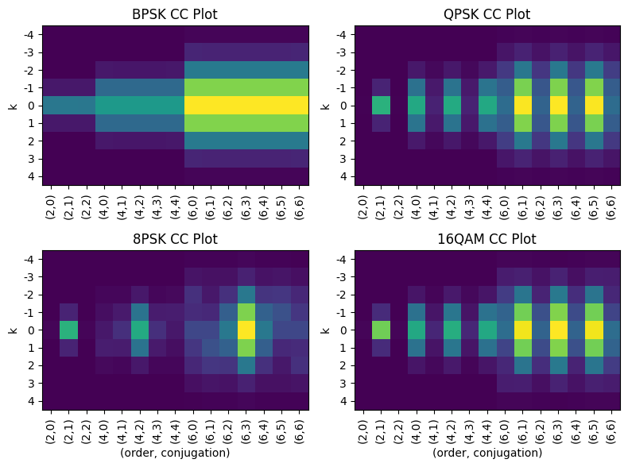
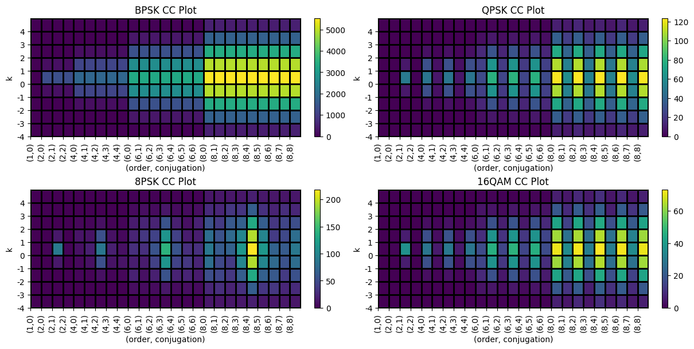

# How-to-create-Cyclic-Cumulant-plot-estimate

Hello, this is just a small guide on how to create Cylic Cumulant plot. The included python notebook will walk you through all the steps.

## Update Log

**09/02/2025**
- Added function to calculate cyclic cumulant at any order and conjugation by automating partition counting
- Added one more section to visualize cyclic cumulant to 8th order
- Added references to papers

## Gallery:

